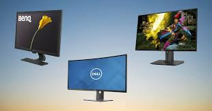
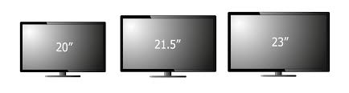

# Buying a Monitor

Are you looking forward to buy a monitor, but don't know if it will fit your needs? If so, you are in the right place, as this website will have a quick guide to the specifications one would look for on a monitor. These specifications include refresh rates, response times, display panel, frame syncing methods, along with resolution and size. 

## Resolutions, Panels, and Sizes of a Monitor

When it comes to looking for a monitor, the first three things that you want to look for would be your ideal monitor size, resolution, and its display panel. 

The resolution of a monitor usually comes in 1080p, 1440p, and 2160p. If you are not able to decide on which resolution to get, think of it this way, 1080p is the resolution with the most visible pixels (lowest pixel density) while 2160p is the resolution with the least visible pixels (highest pixel density). The 2160p monitor will have the sharpest image quality but will be the most expensive out of the bunch while the 1080p monitor will be the cheapest. Along with this, 2160p displays will be more costly and in most cases, have lower refresh rates. When it comes to editing or working on images, 2160p is the way to go, while those who play video games will want a 1080p of 1440p display due to their cheaper price and higher refresh rates. 

As for the size of a monitor, it is completely preference, but when it comes to a 1080p display, it will be the most visually appealing on a 24" display due to the pixel density being not too dense to too spread out. A 1440p monitor will usually have a size of around 27" due to the same reasons a 1080p monitor is usually on 24" displays. A 2160p display has ideal sizes of 27"-32" due to the pixel density. Before all of this though, you should take into consideration the size you will need for a monitor to fit in your workspace, due to there being many different sizes such as ultrawide displays, or curved ones. 

Monitors have three main display panels, they are named IPS, VA, and TN panels. In most cases, it is worth shelling out a bit of extra cash for an IPS panel as they have the best color accuracy out of the three along with the best viewing angles. The contrast of VA panels is the best, and they have moderate viewing angles. The TN panel is the least worth as they have the worst viewing angles and superiority to the other panels. When a monitor has bad viewing angles, it means that it has large shifts in colors depending on where they are seen from. Looking at some panels from the side would cause the screen to seem yellow ruining the color accuracy. To gamers who sit in front of displays, TN or VA panels may be acceptable, but to those who need color accuracy, IPS panels are the best to use. 

### Refresh Rates, Response Times, and Frame Syncing of Monitors

The second three things you want to consider when getting a monitor would be the refresh rates, response times, and frame syncing methods of the monitor.

Refresh rates of monitors are what determines how many frames appear on the screen per second or how smooth the visuals are. This is something that is more important to gaming enthusiasts or those looking for a buttery smooth display. Most displays will come in 60hz, 144hz, and 240hz. 60hz displays can show 60 frames per second, while 144hz displays show 144 frames per second, and 240hz displays show 240 frames per second. When it comes to refresh rates, there are diminishing returns, going from 60hz to 144hz is a huge difference when it comes to how visually smooth something is while going from 144hz to 240hz is not as noticeable. Most 240hz monitors only come in 1080p, and would only be useful to avid or professional gamers who have PC's to support the high frame rates. 144hz will be available on most if not all resolutions and is generally recommended for those who are average gamers or others who are looking for a smoother display. 60hz is something most people will have on their monitors as it is common and cheaper, along with being an amazing option for those who do work or are new to gaming.

Response times of a monitor are important as it determines how long it takes for your monitor to receive inputs from your system. Having a low response time is something most people will want, and if you are someone who does work or more business-like things with your PC, then a response time of 4ms would be about average, while those who have any interest in playing video games should most definitely get a monitor with 1ms response times.

Frame syncing methods would be the methods a monitor uses in order to smooth out the frames that are being sent to it. If there is not any syncing method, the screen appears to be "torn apart" as multiple frames showing different things could appear on the screen. Currently, the two main frame syncing methods are called FreeSync and GSync. These are more apparent on gaming monitors where it is important for frames to be managed properly. Frame syncing only works at certain frame caps, and do not always match the refresh rates of your monitor. For example, the sync range for your monitor may only be 48-75 frames while your monitor could display 144 frames. This means anything outside that range is prone to screen tearing. Along with this, FreeSync will work with either Nvidia or AMD GPUs but are designed mainly for AMD GPUs. GSync on the other hand is only functional with Nvidia GPUs. Both syncing methods work the same. In order to ensure your monitor has the right frame sync range you seek, you can use a website like this: [FreeSync Ranges](https://www.amd.com/en/products/freesync-monitors).

#### Ready!

With that, you are now ready to embark on your journey of purchasing a monitor that suits all your ideals and needs!
